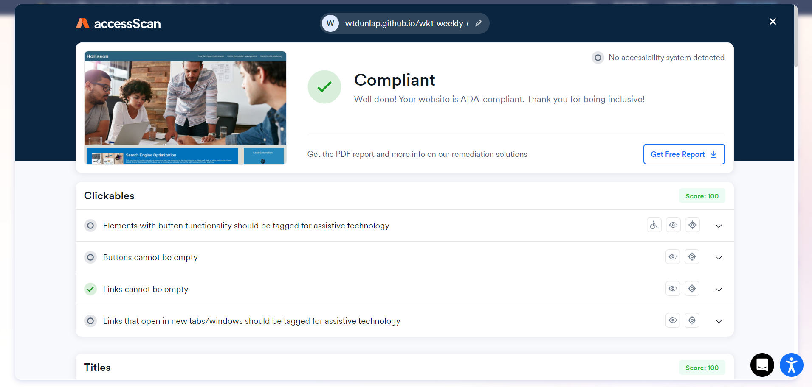
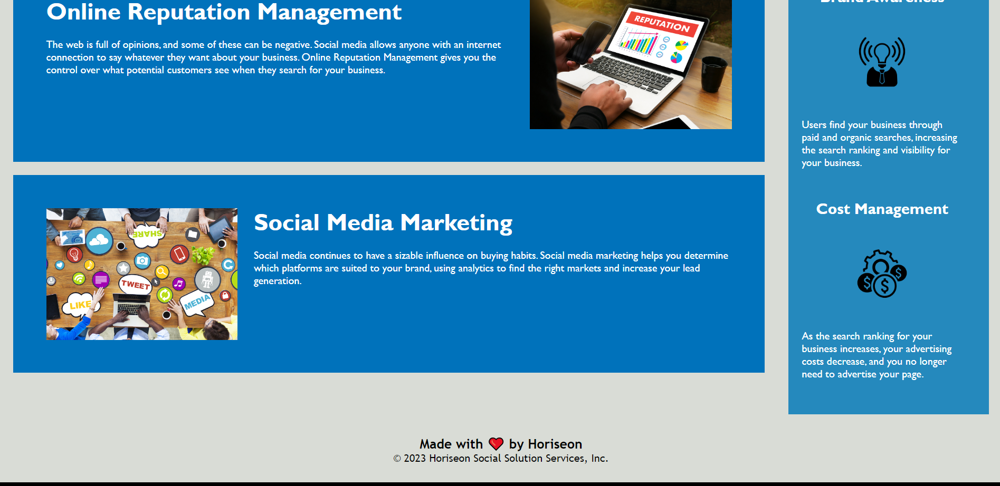

# Week 1 - Weekly Challenge

The assignment was to refactor existing code to
make it easier to read, use semantic elements, 
and make the website more accessible through use
of alt text for images and better semantic 
breakdown of elements throughout the page.

## Accessibility 

Alt text was assign to every image excluding the
background image, as per ADA guidelines. 
Different elements were changed to semantic 
elements to assist with screen readers navigating
the website.

## Challenges

The CSS was an absolute mess with dozens of calls
to classes that shouldn't have existed in the 
first place. While not as bad, the HTML was also
poorly written with almost no semantic elements.

## Fully deployed and functional website

https://wtdunlap.github.io/wk1-weekly-challenge/

## Credits

This was a single person project with limited
help from outside sources. Instructor feedback 
was requested and recieved to clarify project
guidelines.